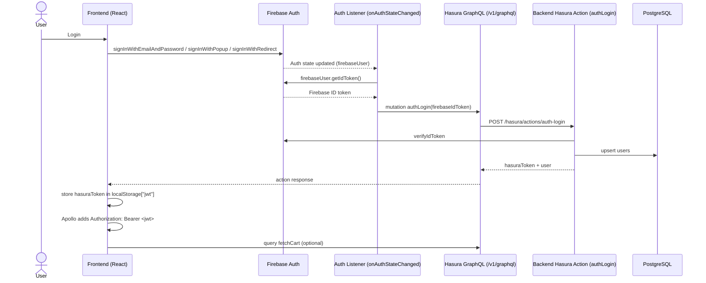
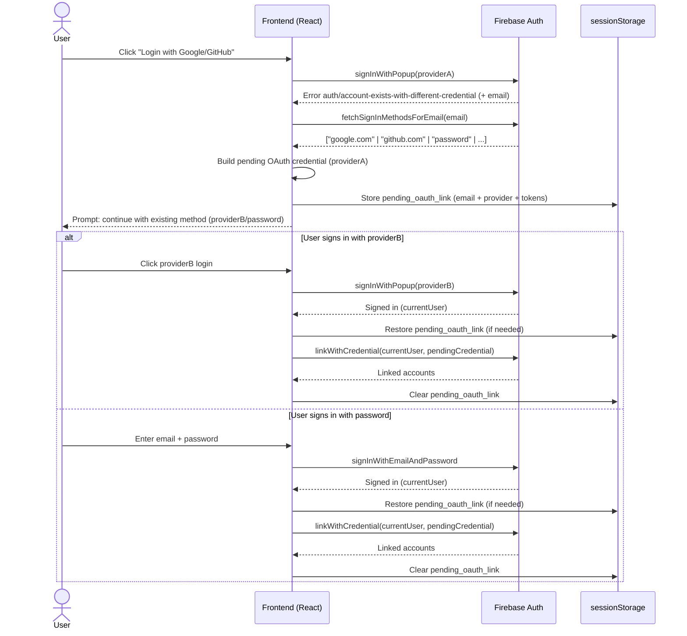
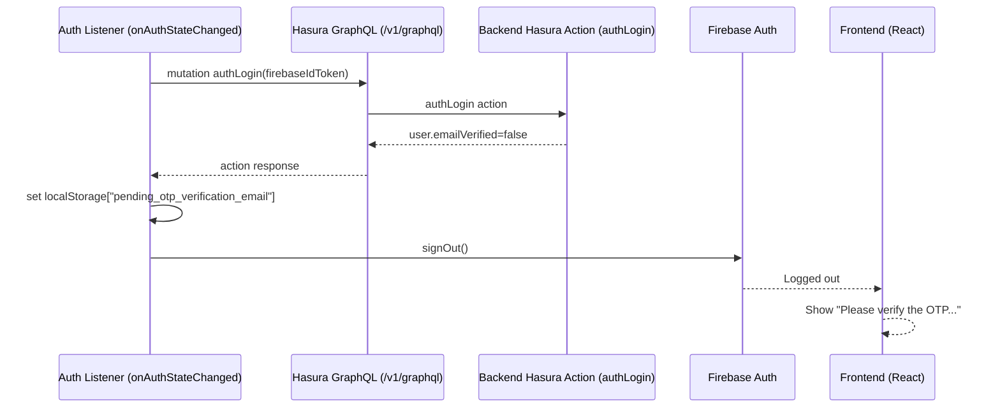
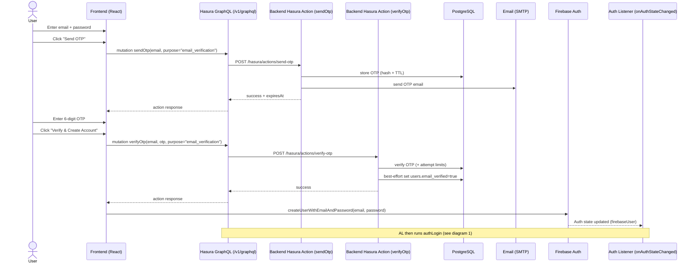
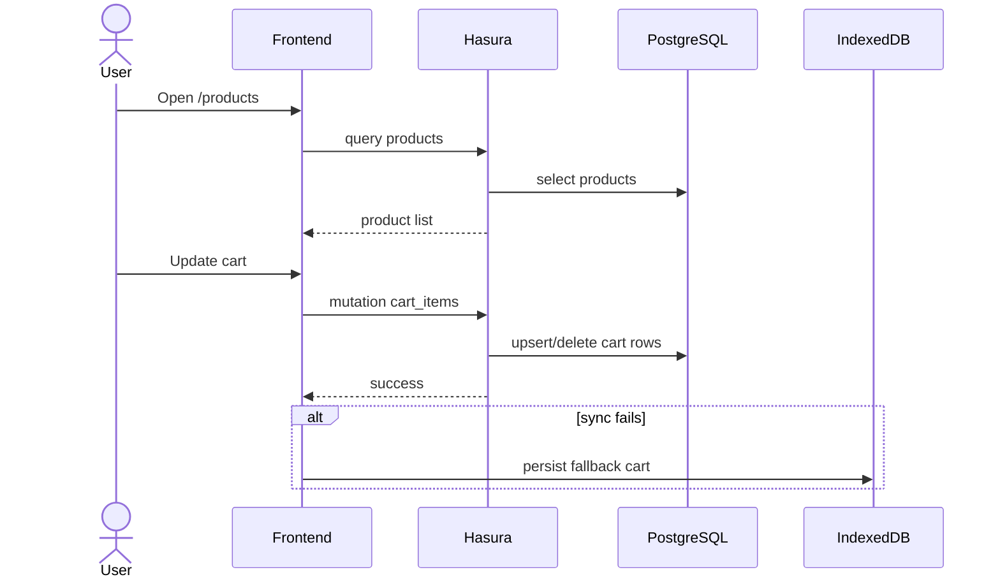
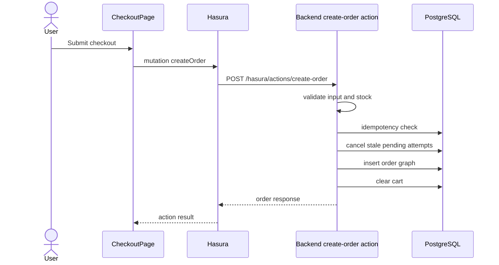
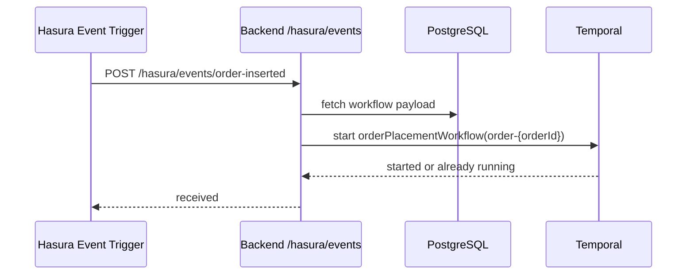
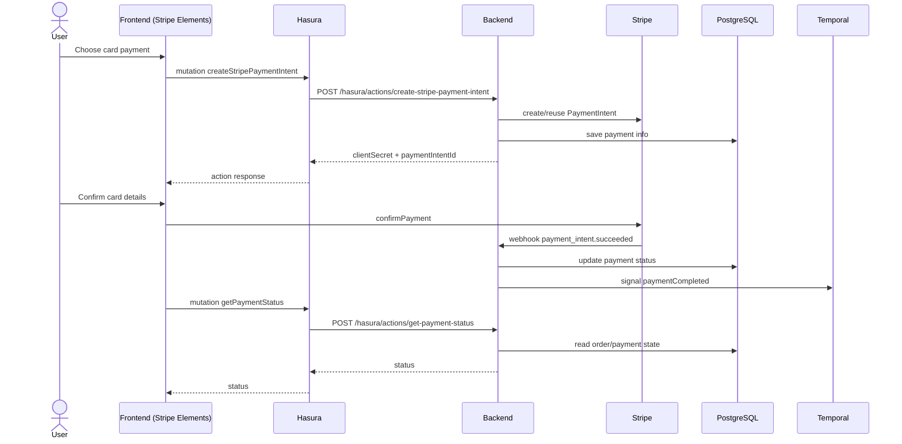
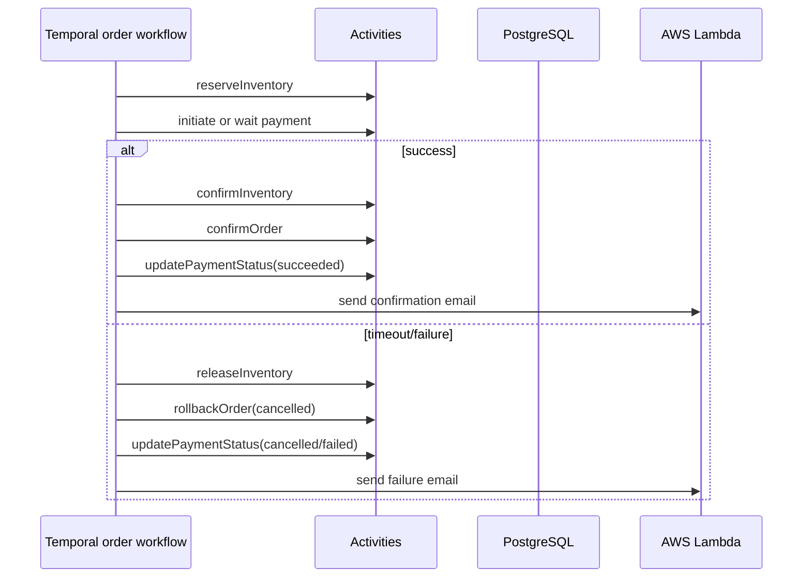
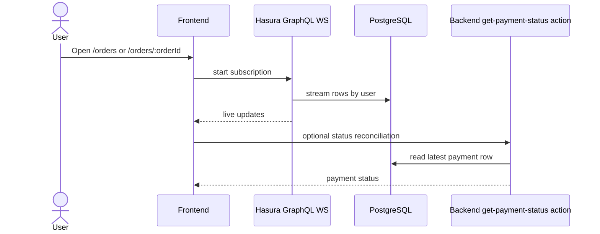

# Sequence Diagrams

Last updated: 2026-03-15

## 1. Login and Token Exchange

## 1.1 OAuth "Account Exists" Linking (Google/GitHub same email)

## 1.2 Email Verification Gate (Password logins)

## 1.3 Signup + OTP Verification (Password)

## 2. Product Browse and Cart Sync

## 3. Checkout Create Order

## 4. Hasura Event to Temporal

## 5. Stripe Card Payment

## 6. Workflow Success and Failure

## 7. Realtime Order History

