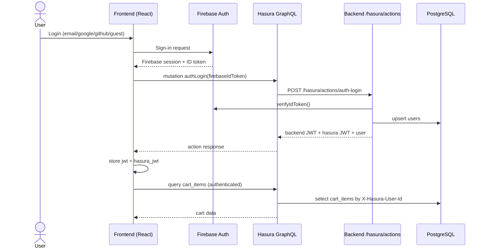
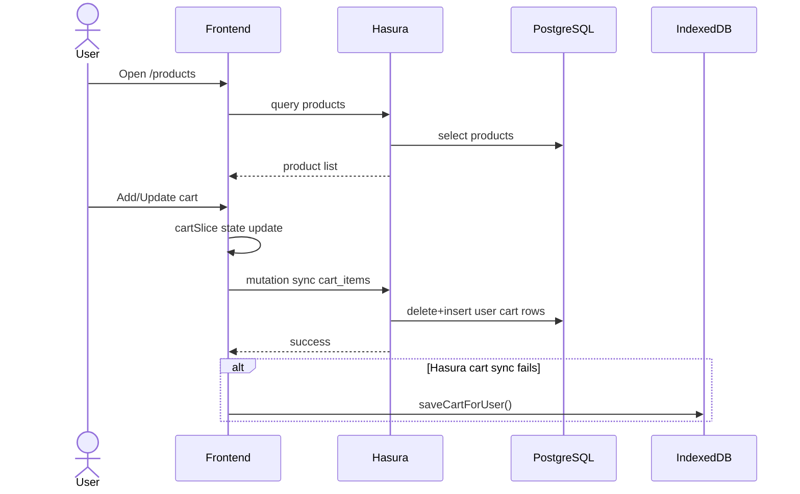
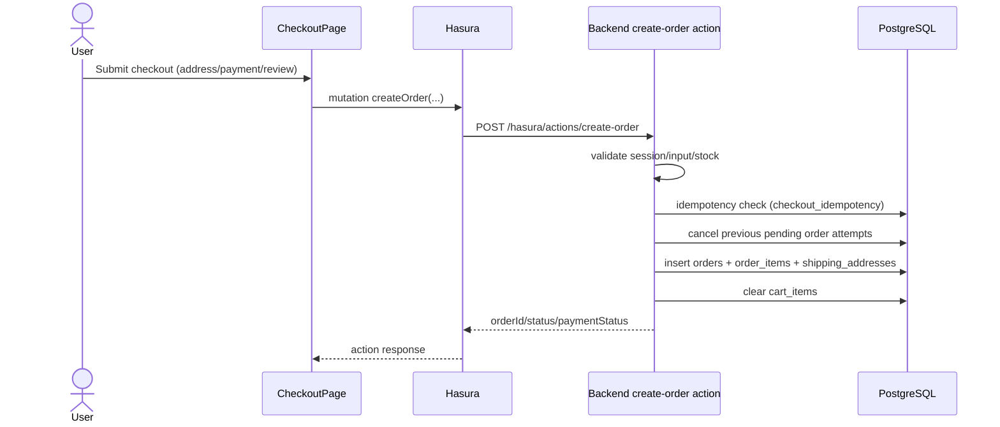
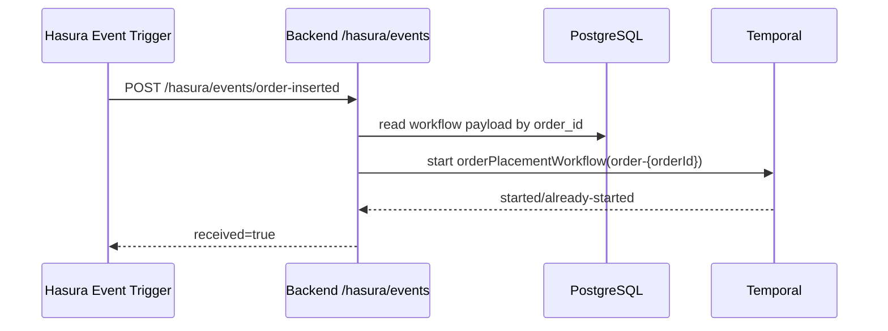
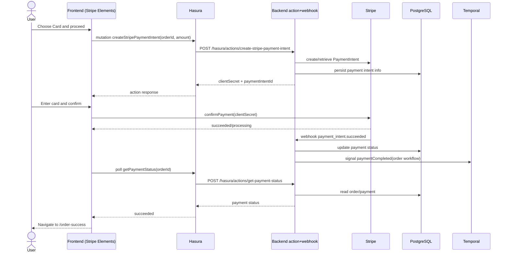
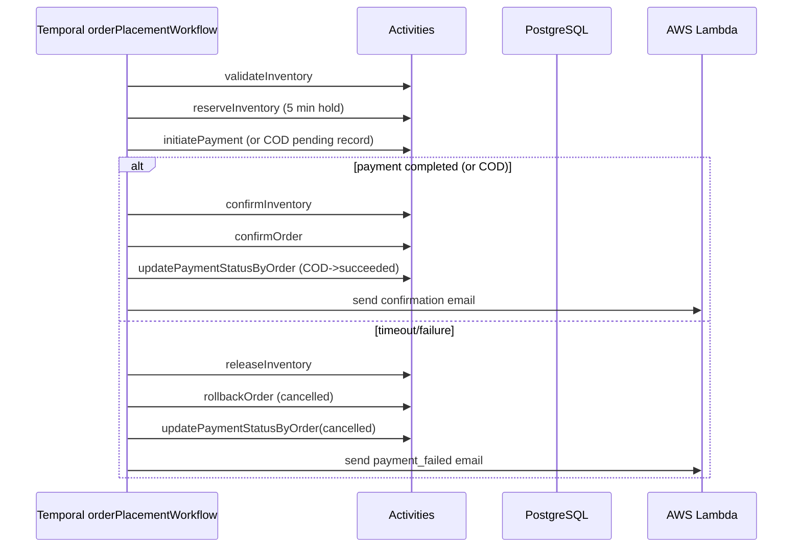
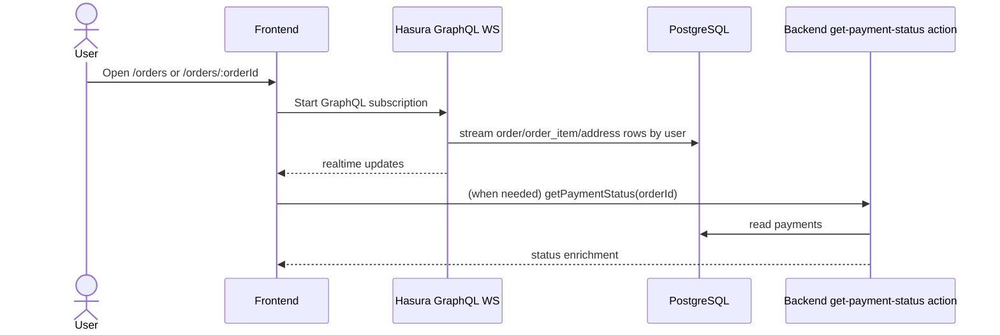

# Sequence Diagrams

## 1. Login and Token Exchange

## 2. Product Browsing and Cart Sync

## 3. Checkout (Create Order)

## 4. Hasura Event -> Temporal Workflow Start

## 5. Card Payment (Stripe)

## 6. Workflow Success/Failure Path

## 7. Order History and Detail Realtime

